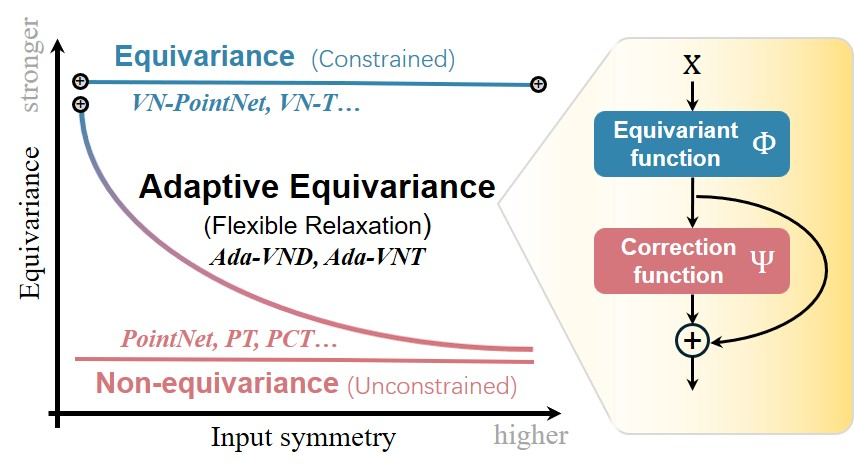
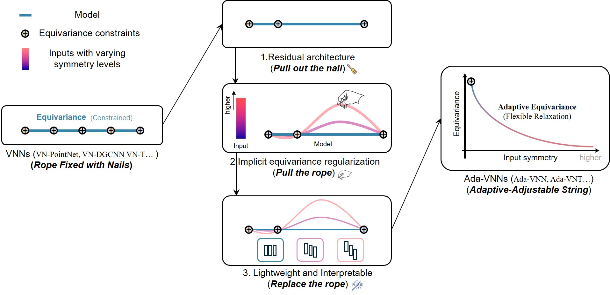

# Ada-VNNs
An official implementation of Ada-VNNs

<div align="center">
  
</div>

Vector Neuron Networks (VNNs) have been widely adopted in various 3D tasks due to their data efficiency and strong generalization capabilities rooted in equivariance. However, the rigid equivariance constraints of VNNs limit their ability to handle the prevalent problem of symmetry breaking in the 3D world, where models may need to produce outputs with reduced symmetry from inputs with high symmetry. In this paper, we propose an adaptive equivariance paradigm within the Vector Neuron (VN) framework, comprising three key designs:
(1) Architecturally, we introduce a residual architecture that transforms the rigid equivariance constraints of VNNs into soft priors, preserving their symmetry-based inductive bias while enabling symmetry breaking.(2) Methodologically, we derive an implicit equivariance regularization method that allows VNNs to dynamically adjust their equivariance constraints according to the symmetry level of input data.(3) Structurally, we design a lightweight and interpretable module that allows VNNs to regulate equivariance in a simpler and more transparent manner. Experiments on 26 categories with varying input symmetries demonstrate that our approach achieves adaptive equivariance, improving the average performance of VNNs on pose estimation tasks by a factor of 5, and by a factor of 33 on highly symmetric inputs.



# Data Preparation
1.Download[ModelNet40](https://shapenet.cs.stanford.edu/media/modelnet40_normal_resampled.zip), and place it in the following directory:  `your path/modelnet40_normal_resampled/`.

2.Download[ShapeNetAtlasNet](https://condor-datasets.s3.us-east-2.amazonaws.com/dataset/ShapeNetAtlasNetH5_1024.zip) (ShapeNetAtlasNet covers 13 categories of ShapeNetCore ('bench', 'cabinet', 'car', 'cellphone', 'chair', 'couch', 'firearm', 'lamp', 'monitor', 'plane', 'speaker', 'table', 'watercraft')), and place it in the following directory: `your path/ShapeNetAtlasNetH5_1024/`.

3.Download[ShapeNet13](https://drive.google.com/file/d/1HRciLTnFbTxKJiiqpvnw3bNC5rSeg-qp/view?usp=sharing)) (additional categories selected from ShapeNetCore ('can', 'bookshelf', 'jar', 'appliance', 'bath', 'bus', 'walkie-talkie', 'clock', 'faucet', 'guitar', 'laptop', 'mug', 'pot').), and place it in the following directory: `your path/ScanObjectNN`.

# Environment Preparation
We tested the code on pytorch1.10 (cuda11.1).
`pip install torch==1.10.1+cu111 torchvision==0.11.2+cu111 torchaudio==0.10.1 -f https://download.pytorch.org/whl/cu111/torch_stable.html`

# Usage
## Training
```bash
python train_pose.py --model $optional$ --data_choice shapenet
```
## Testing
```bash
python test_pose.py --model $optional$ --data_choice modelnet
```

Here, `$optional$` can be one of the following: `vn_pointnet`, `vn_dgcnn`, `vn_transformer`, `ada_vnn`, `ada_vntransformer`.
# License
MIT License


# Acknowledgement
This repository is built upon the following works:  [PointNet/PointNet++](https://github.com/yanx27/Pointnet_Pointnet2_pytorch), [DGCNN](https://github.com/WangYueFt/dgcnn), [VNN](https://github.com/FlyingGiraffe/vnn), [OAVNN](https://github.com/sidhikabalachandar/oavnn) and [VN-Transformer](https://github.com/lucidrains/VN-transformer). We gratefully acknowledge the authors for their foundational contributions.

